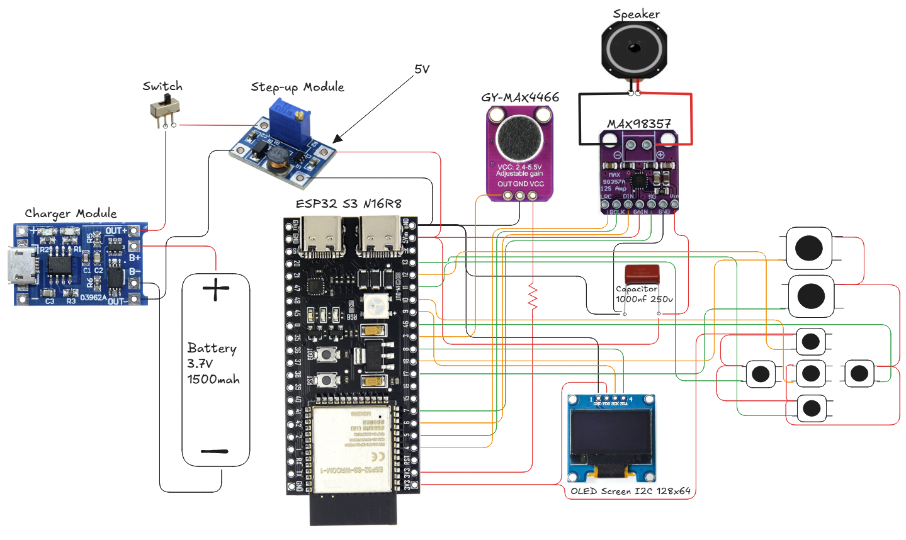

# Translating Device

## Motivation
This project was built to help me communicate with people who do not speak English
without relying on a smartphone or manually using translation applications such as
Google Translate.

Using a phone for real-time conversation is often slow, distracting, and impractical.
This device enables faster, more natural communication through a dedicated,
standalone translation system.

## System Overview
The TranslatingDevice is a standalone IoT-based speech translation system.
It captures spoken audio -> processes it on a AI server -> plays
back the translated speech in near real time.

## System Workflow
1. The ESP32-S3 captures the user's voice using an external microphone.
2. The recorded audio is sent to a backend API over Wi-Fi or Hotspot.
3. The server performs speech-to-text (STT) to transcribe the spoken language.
4. The transcribed text is translated into the target language.
5. A text-to-speech (TTS) model generates audio from the translated text.
6. The generated audio is sent back to the ESP32-S3.
7. The ESP32-S3 plays the translated speech through a speaker.

## AI Model:
1. [Faster-Whisper large v3 Turbo](https://huggingface.co/Systran/faster-whisper-large-v3) (Speech to text model)
2. [Facebook/NLLB-200-3.3B](https://huggingface.co/facebook/nllb-200-3.3B) (Large language model)
3. [Kokoro 82M](https://huggingface.co/hexgrad/Kokoro-82M) (Text to speech model)

## Hardware Components
| No | Component | Model / Type | Quantity | Purpose |
|----|----------|--------------|----------|---------|
| 1 | Microphone | GY-MAX4466 | 1 | Captures the user's voice input |
| 2 | Audio Amplifier | MAX98357 (I2S) | 1 | Drives the speaker using digital audio |
| 3 | Display | OLED 0.96" I2C 128×64 | 1 | User interface and navigation |
| 4 | Microcontroller | ESP32-S3 N16R8 | 1 | Controls the entire system |
| 5 | Big Push Button | — | 2 | Triggers translation |
| 6 | Small Push Button | — | 5 | Menu and navigation controls |
| 7 | Capacitor | 1000nF 250V | 1 | Reduces noise for smoother audio output |
| 8 | Power Switch | — | 1 | Turns the device on and off |
| 9 | Battery Holder | — | 1 | Holds the lithium battery |
|10 | Lithium Battery | 3.7V 1500mAh | 1 | Powers the device |
|11 | Battery Charger Module | — | 1 | Charges the lithium battery |
|12 | Step-Up Module | — | 1 | Boosts battery voltage to required level |
|13 | Speaker | — | 1 | Outputs translated audio |

## Wiring Configuration

| Component | Signal | ESP32-S3 Pin | Notes |
|---------|-------|-------------|------|
| **Microphone (GY-MAX4466)** | OUT | GPIO 3 | Analog audio input (ADC) |
|  | VCC | 3.3V | Do NOT use 5V |
|  | GND | GND | Common ground |
| **Audio Amplifier (MAX98357)** | DIN | GPIO 6 | I2S data |
|  | BCLK | GPIO 5 | I2S bit clock |
|  | LRC / WS | GPIO 4 | I2S word select |
|  | SD / EN | GPIO 7 | Amplifier enable |
|  | VCC | 5V | From step-up module |
|  | GND | GND | Common ground |
| **Speaker** | + / − | Amp Output | Connected to MAX98357 |
| **OLED Display (0.96” I2C)** | SDA | GPIO 8 | I2C data |
|  | SCL | GPIO 9 | I2C clock |
|  | VCC | 3.3V | OLED power |
|  | GND | GND | Common ground |
| **Record Button 1** | Signal | GPIO 18 | INPUT_PULLDOWN |
| **Record Button 2** | Signal | GPIO 17 | INPUT_PULLDOWN |
| **Navigation Button (UP)** | Signal | GPIO 12 | INPUT_PULLDOWN |
| **Navigation Button (DOWN)** | Signal | GPIO 13 | INPUT_PULLDOWN |
| **Navigation Button (LEFT)** | Signal | GPIO 11 | INPUT_PULLDOWN |
| **Navigation Button (SELECT)** | Signal | GPIO 10 | INPUT_PULLDOWN |
| **Navigation Button (RIGHT)** | Signal | GPIO 46 | INPUT_PULLDOWN |
| **Power Switch** | — | Battery line | Main power control |
| **Battery (3.7V Li-ion)** | + / − | Battery holder | Primary power |
| **Battery Charger Module** | B+ / B− | Battery | Charging circuit |
| **Step-Up Module** | OUT+ | 5V rail | Boosts 3.7V → 5V |
| **Capacitor (1000nF)** | — | Near amp VCC | Audio noise filtering |

## Communication Flow
1. ESP32 records audio from the microphone
2. Audio data is sent via HTTP POST to the API endpoint
3. Cloudflare Tunnel securely forwards the request to the local server
    Backend server:
    - Transcribes audio (STT)
    - Translates text
    - Generates TTS audio
    - Generated audio is sent back to the ESP32 as a response
4. ESP32 plays the audio through the speaker